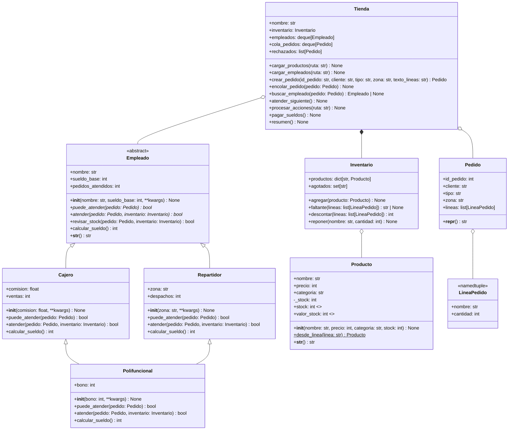

# Pontificia Universidad Católica de Chile
## Escuela de Ingeniería — Departamento de Ciencia de la Computación
## IIC2233 — Programación Avanzada 2026-2

**Publicación: 27 de agosto de 2026**
**Actividad evaluada (SIMULACRO de práctica; ver "Notas del simulacro" al final)**

# Actividad 3
# Programación Orientada a Objetos Avanzado

## Entrega

- **Lugar:** Repositorio personal de GitHub — Carpeta: `Actividades/AC3`
- **Fecha máxima de entrega:** Jueves 27 de agosto 17:10
- **Ejecución de actividad:** La Actividad será ejecutada únicamente desde la terminal
  del computador. Los paths relativos utilizados en la Actividad deben ser coherentes
  con esta instrucción, y no pueden modificarse.

**Importante:** Antes de comenzar, comprueba que Git esté funcionando correctamente en tu
repositorio privado. Para esto, sube los archivos base de la actividad de inmediato
(`add`, `commit`, `push`). Se espera que en esta actividad (así como en las demás
actividades y tareas) utilices Git a lo largo de todo tu desarrollo como una herramienta,
no solo como un método de entrega. Es por esto que recomendamos enfáticamente que vayas
subiendo tus cambios constantemente (`push`), ya que problemas de último minuto
relacionados con la entrega y Git no serán considerados.

## Objetivos de la actividad

- Implementar clases siguiendo especificaciones técnicas y un diagrama de clases.
- Manejar correctamente herencia, multiherencia (`**kwargs` y una sola llamada a
  `super()`) y clases abstractas.
- Extender métodos de las clases madres con `super()` y aprovechar el polimorfismo.
- Controlar atributos mediante *properties* (con validación y de solo lectura) y usar
  decoradores (`@property`, `@classmethod` y un decorador propio).
- Usar las estructuras de datos adecuadas (diccionario, set, cola, stack, *namedtuple*)
  para cargar y procesar datos desde archivos, justificando la elección.

## Introducción

El minimarket **DCComercio** creció y ahora recibe pedidos en el local y a domicilio.
Su dueño tenía un programa a medio construir, hecho por un programador anterior que se
fue del país, y te pidió que lo termines.

El programa carga los productos y los empleados desde archivos, y luego simula una
jornada leyendo un archivo de acciones: llegan pedidos, los empleados los atienden en
orden y se reponen productos. Al final del día se pagan los sueldos y se muestra un
resumen del inventario.

## Diseño del programa

El programador anterior dejó el siguiente modelo de clases (las *properties* se marcan
con `<<property>>`, los métodos abstractos con `*` y los métodos de clase con `$`; los
atributos y métodos heredados no se repiten en las subclases):



Si no puedes ver el diagrama, léelo así: `Empleado` es una clase abstracta; `Cajero` y
`Repartidor` heredan de `Empleado`; `Polifuncional` hereda de `Cajero` **y** de
`Repartidor` (multiherencia). `Tienda` contiene un `Inventario`, una fila de `Empleado`
(`deque`), una cola de `Pedido` (`deque`) y un stack de `Pedido` rechazados (`list`).
`Inventario` contiene `Producto` en un diccionario (llave: nombre) y un `set` con los
nombres agotados. Cada `Pedido` contiene una lista de `LineaPedido` (*namedtuple*).

## Archivos

En el directorio de la actividad encontrarás lo siguiente:

- **No modificar** `bases.py`: contiene las constantes `COSTO_DESPACHO` y
  `BONO_DESPACHO`, la *namedtuple* `LineaPedido`, la clase `Pedido` y la clase abstracta
  `Empleado`. No debes modificar nada en este archivo, pero **se recomienda que leas el
  código**, ya que las clases que debes completar heredan de estas.
- **Modificar / Entregar** `productos.py`: contiene las clases `Producto` e
  `Inventario`. Trabajarás aquí en la **Parte 1**.
- **Modificar / Entregar** `empleados.py`: contiene las clases `Cajero`, `Repartidor` y
  `Polifuncional`. Trabajarás aquí en las **Partes 2 y 3**.
- **Modificar / Entregar** `tienda.py`: contiene la clase `Tienda`, que carga los
  archivos y ejecuta la simulación. Trabajarás aquí en la **Parte 4**.
- **Modificar / Entregar** `utils.py`: contiene el decorador `registrar_llamada` de la
  **Parte 5**. Hasta que lo completes, retorna la función sin cambios, así que el
  programa corre igual.
- **No modificar** `main.py`: programa principal. Ejecútalo con `python3 main.py`
  parado en la carpeta de la actividad. Lo único que puedes cambiar es la constante
  `CARPETA_DATOS = "data"` (por `"data_grande"`) para probar con el segundo juego de
  datos; la entrega debe funcionar con `"data"`.
- **No entregar** `pruebas_empleados.py`: pruebas de las Partes 1 a 3 que no necesitan
  la Parte 4 (`python3 pruebas_empleados.py`). Puedes modificarlo o borrarlo.
- **No modificar** `data/` y `data_grande/`: archivos de datos. La salida esperada
  corresponde a `data/`; `data_grande/` tiene el mismo formato con más empleados y
  pedidos. **Al momento de la evaluación se podrían usar otros archivos con el mismo
  formato**, así que tu código no debe depender de los valores específicos de estos
  (nada de escribir `12` o `"Elena"` a mano).

### Archivos de datos

`data/productos.csv` tiene encabezado y en cada línea el nombre, precio, categoría y
stock inicial de un producto, separados por coma:

```
nombre,precio,categoria,stock
Cafe,1500,bebidas,5
Te,1200,bebidas,8
Torta,12000,pasteleria,-2
```

Ojo: el archivo trae un stock negativo a propósito (error de digitación del dueño). Tu
*property* deberá rechazarlo.

`data/empleados.csv` tiene encabezado y en cada línea el tipo (`cajero`, `repartidor` o
`polifuncional`), nombre, sueldo base, comisión, zona y bono. Las columnas que no aplican
a un tipo traen `-` o `0` y deben ignorarse:

```
tipo,nombre,sueldo_base,comision,zona,bono
cajero,Ana,450000,0.05,-,0
repartidor,Carla,400000,0,Norte,0
polifuncional,Elena,480000,0.03,Oriente,25000
```

`data/acciones.txt` **no** tiene encabezado. Cada línea parte con el nombre de la acción
y luego sus argumentos, separados por coma. Las acciones posibles son:

- `pedido,<id>,<cliente>,<tipo>,<zona>,<productos>`: llega un pedido y se pone **al final
  de la cola**. `tipo` es `local` o `delivery`; `zona` es `-` si el pedido es local. Los
  productos vienen como `Cafe:2;Croissant:1` (nombre y cantidad separados por `:`, líneas
  separadas por `;`).
- `atender`: se saca el **primer** pedido de la cola y se le asigna un empleado.
- `reponer,<producto>,<cantidad>`: se suma `cantidad` al stock del producto (puede ser
  negativa, para corregir un error de conteo).

```
pedido,1,Camila,local,-,Cafe:2;Croissant:1
pedido,2,Tomas,delivery,Norte,Sandwich:2;Agua:2
atender
atender
reponer,Torta,3
```

## Modelo de datos

En esta sección se ve en detalle lo que hay en `bases.py`.

**No modificar** `COSTO_DESPACHO = 2500` y `BONO_DESPACHO = 1500`. El primero se le cobra
al cliente en cada pedido *delivery*; el segundo lo recibe el repartidor por cada pedido
que despacha.

**No modificar** `LineaPedido = namedtuple("LineaPedido", ["nombre", "cantidad"])`. Una
línea de un pedido: nombre del producto y cantidad pedida. Se accede con `linea.nombre` y
`linea.cantidad`.

**No modificar** `class Pedido`:

- `__init__(self, id_pedido: int, cliente: str, tipo: str, zona: str, lineas: list)`
  guarda los cinco atributos con el mismo nombre. `lineas` es una lista de `LineaPedido`.
- `__repr__(self) -> str` retorna `Pedido #<id> (<tipo>, <cliente>)`, por ejemplo
  `Pedido #1 (local, Camila)`. Como no hay `__str__`, `print(pedido)` y los *f-strings*
  usan esta representación.

**No modificar** `class Empleado(ABC)`:

- `__init__(self, nombre: str, sueldo_base: int, **kwargs) -> None` hace una llamada a
  `super().__init__(**kwargs)` (esto facilita llamar a todos los `__init__` en el caso de
  multiherencia) y luego asigna `self.nombre`, `self.sueldo_base` y
  `self.pedidos_atendidos = 0`.
- `puede_atender(self, pedido) -> bool` es un **método abstracto**: cada subclase debe
  decir si es capaz de atender ese pedido.
- `atender(self, pedido, inventario) -> bool` es un **método abstracto**: cada subclase
  atiende el pedido a su manera y retorna `True` si lo logró y `False` si lo rechazó.
- `revisar_stock(self, pedido, inventario) -> bool` es un método **ya implementado** que
  usa `inventario.faltante(pedido.lineas)`: si no falta nada retorna `True`; si falta
  algo imprime `[<empleado>] <pedido> rechazado: falta <producto>` y retorna `False`.
  Úsalo desde tus métodos `atender`.
- `calcular_sueldo(self) -> int` retorna `self.sueldo_base`. Las subclases deben
  **extenderlo**, no reemplazarlo.
- `__str__(self) -> str` retorna `<NombreDeLaClase> <nombre>`, por ejemplo `Cajero Ana` o
  `Polifuncional Elena`. Se usa dentro de los mensajes con `[{self}]`.

## Parte 1. Productos e inventario (1,25 PC) — `productos.py`

**`class Producto`**

- El inicializador ya recibe `nombre`, `precio`, `categoria` y `stock` y termina con
  `self.stock = stock`, que debe pasar por el *setter* (así el stock inicial también se
  valida). **Antes** de esa línea crea el atributo "privado" `self._stock = 0`: el
  *setter* lo lee para armar su mensaje, y si no existe obtendrás
  `AttributeError: 'Producto' object has no attribute '_stock'`. Por lo mismo, cuando el
  stock inicial es inválido el "stock actual" es `0`.
- Implementa el **método de clase**[^1] `desde_linea(cls, linea: str) -> Producto`: recibe
  una línea del archivo **ya sin el salto de línea** (por ejemplo `Cafe,1500,bebidas,5`),
  la separa por coma y retorna una instancia (`precio` y `stock` como `int`). Como es un
  método de clase, se llama sin instanciar: `Producto.desde_linea("Cafe,1500,bebidas,5")`,
  y `cargar_productos` (ya implementado en `tienda.py`) lo usa así.
- Implementa la *property* `stock` con *getter* y *setter*. El *setter* recibe un valor
  entero; si es **negativo**, imprime
  `Stock inválido para <nombre>: <valor>. Se mantiene en <stock actual>` y **no** cambia
  el atributo; si es válido, lo guarda. Con `Torta,12000,pasteleria,-2` debe imprimir
  `Stock inválido para Torta: -2. Se mantiene en 0`. Recuerda que dentro del *getter* y
  del *setter* debes usar `self._stock`, nunca `self.stock`.
- Implementa la *property* de **solo lectura** `valor_stock` que retorna
  `precio * stock`. No debe tener *setter*. `Tienda.resumen` (ya implementado) la suma
  para imprimir `Valor del inventario: $<suma>`.
- Implementa `__str__` con el formato `<nombre> ($<precio>) - stock: <stock>`, por
  ejemplo `Cafe ($1500) - stock: 5`.

[^1]: Para indicar que un método es "método de clase" se utiliza el decorador
`@classmethod`. Su primer parámetro es `cls` (la clase misma) en vez de `self`, así que
`cls(...)` crea una instancia de esa clase.

**`class Inventario`**

- `__init__`: crea `self.productos` y `self.agotados` con la estructura que indica el
  diagrama (`dict` nombre → `Producto` y `set` de nombres) y escribe en un comentario de
  una línea por qué es la adecuada: `faltante`, `descontar` y `reponer` **buscan un
  producto por su nombre** (sin recorrer todo) y un producto puede agotarse y reponerse
  varias veces **sin quedar repetido** en `agotados`. `Tienda.resumen` usa
  `self.productos.values()` y `sorted(self.agotados)`.
- `agregar(self, producto) -> None`: guarda el producto usando su nombre como llave. Si el
  producto llega con stock 0 debe quedar registrado en `agotados`.
- `faltante(self, lineas) -> str | None`: recibe una lista de `LineaPedido` y retorna el
  nombre del **primer** producto (en el orden de la lista) que no existe en el inventario
  o cuyo stock es menor a la cantidad pedida. Si todo está disponible retorna `None`.
- `descontar(self, lineas) -> int`: descuenta del stock la cantidad de cada línea y
  retorna el total a pagar (suma de `precio * cantidad`). Si un producto queda en 0, lo
  agrega a `agotados`. Puedes asumir que `faltante(lineas)` ya retornó `None`.
- `reponer(self, nombre, cantidad) -> None`: si el producto no existe imprime
  `No existe el producto <nombre>`. Si existe, suma `cantidad` a su stock (**la
  validación la hace la property**: no la repitas aquí), lo saca de `agotados` si quedó
  con stock mayor a 0, e imprime `Reposición de <nombre>: ahora tiene <stock> unidades`.
  Por ejemplo, en `data_grande` la acción `reponer,Te,-20` llega cuando Te tiene 6
  unidades: el *setter* imprime `Stock inválido para Te: -14. Se mantiene en 6` y
  luego `reponer` imprime `Reposición de Te: ahora tiene 6 unidades`.

## Parte 2. Cajeros y repartidores (1,25 PC) — `empleados.py`

Ambas clases heredan de `Empleado`. Como `Empleado` tiene métodos abstractos, **mientras
no implementes todos**, instanciar tus clases lanzará
`TypeError: Can't instantiate abstract class Cajero without an implementation for
abstract methods 'atender', 'puede_atender'`. Léelo: te dice exactamente qué falta.

**`class Cajero(Empleado)`**

- `__init__(self, comision: float, **kwargs)`: hace **una** llamada a
  `super().__init__(**kwargs)` y crea `self.comision` y `self.ventas = 0`.
- `puede_atender(self, pedido) -> bool`: `True` solo si `pedido.tipo == "local"`.
- `atender(self, pedido, inventario) -> bool`: si `self.revisar_stock(...)` retorna
  `False`, retorna `False` (el mensaje de rechazo ya lo imprime `revisar_stock`). Si no,
  descuenta del inventario, suma el total a `self.ventas`, aumenta
  `self.pedidos_atendidos` en 1, imprime `[<empleado>] <pedido> cobrado: $<total>` y
  retorna `True`. Ejemplo: `[Cajero Ana] Pedido #1 (local, Camila) cobrado: $4300`.
- `calcular_sueldo(self) -> int`: **extiende** el de `Empleado` (llama a
  `super().calcular_sueldo()`) y le suma `int(self.ventas * self.comision)`.

**`class Repartidor(Empleado)`**

- `__init__(self, zona: str, **kwargs)`: una llamada a `super().__init__(**kwargs)`, crea
  `self.zona` y `self.despachos = 0`.
- `puede_atender(self, pedido) -> bool`: `True` solo si el pedido es `delivery` **y**
  `pedido.zona` es igual a la zona del repartidor.
- `atender(self, pedido, inventario) -> bool`: igual que el cajero, pero el total es lo
  descontado **más** `COSTO_DESPACHO`, aumenta `self.despachos` y
  `self.pedidos_atendidos`, e imprime
  `[<empleado>] <pedido> despachado a <zona>: $<total>`. Ejemplo:
  `[Repartidor Carla] Pedido #2 (delivery, Tomas) despachado a Norte: $11300`.
- `calcular_sueldo(self) -> int`: extiende el de `Empleado` sumando
  `BONO_DESPACHO * self.despachos`.

Para probar esta parte sin la Parte 4 ejecuta `python3 pruebas_empleados.py`: instancia
con *keywords* (`Cajero(nombre="Ana", sueldo_base=450000, comision=0.05)`) y usa un
`Inventario` de la Parte 1. Con las Partes 1 y 2 listas imprime las primeras 11 líneas
de la salida que aparece al final de la Parte 3 y luego se cae con
`TypeError: Polifuncional() takes no arguments` (falta la Parte 3).

## Parte 3. Empleados polifuncionales (1,0 PC) — `empleados.py`

Elena hace de todo: atiende en caja los pedidos locales y reparte los pedidos *delivery*
de su zona. Además, por contrato recibe un **bono fijo** al mes.

- Haz que `Polifuncional` herede de `Cajero` **y** de `Repartidor` (en ese orden).
  Escribe en un comentario dentro de la clase el MRO resultante (puedes verificarlo con
  `print(Polifuncional.__mro__)`; `main.py` también lo imprime).
- `__init__(self, bono: int, **kwargs)`: **una sola** llamada a `super().__init__(**kwargs)`
  y crea `self.bono`. Piensa qué argumentos deben venir en `kwargs` para que `Cajero`,
  `Repartidor` y `Empleado` reciban cada uno lo suyo (revisa cómo se instancia en
  `pruebas_empleados.py` y en la Parte 4).
- `puede_atender(self, pedido) -> bool`: `True` si lo puede atender como cajero **o**
  como repartidor. Ojo: si solo heredas sin redefinir, por el MRO se usará la versión de
  `Cajero` y Elena nunca haría *delivery*. Puedes llamar a una versión puntual con
  `Cajero.puede_atender(self, pedido)`.
- `atender(self, pedido, inventario) -> bool`: si el pedido es local, atiende como
  `Cajero`; si es *delivery*, como `Repartidor` (llamadas puntuales, igual que arriba).
- `calcular_sueldo(self) -> int`: una sola llamada a `super().calcular_sueldo()` más
  `self.bono`. Si las Partes 2 y 3 están bien hechas, gracias al MRO el resultado será
  `sueldo_base + comisión por ventas + bono por despachos + bono`, sin escribir esa suma a
  mano. Con los datos entregados, Elena debe recibir `$508081`. Si te da otro número,
  revisa dónde cortaste la cadena de `super()`.

Con las Partes 1 a 3 listas, `python3 pruebas_empleados.py` debe imprimir exactamente:

```
True False
[Cajero Ana] Pedido #1 (local, Camila) cobrado: $3000
True
[Cajero Ana] Pedido #3 (local, Sofia) rechazado: falta Croissant
False
450150 1
False True
[Repartidor Carla] Pedido #2 (delivery, Tomas) despachado a Norte: $4000
True
401500 1
Cafe ($1500) - stock: 2
['Polifuncional', 'Cajero', 'Repartidor', 'Empleado', 'ABC', 'object']
True False True
508081
```

(`508081` sale de `480000 + int(2700 * 0.03) + 1500 * 2 + 25000`.)

## Parte 4. La tienda (1,0 PC) — `tienda.py`

Completa los `TODO` de la clase `Tienda`. Ya están implementados `cargar_productos`
(úsalo de ejemplo), `crear_pedido`, `buscar_empleado`, `procesar_acciones` y `resumen`;
léelos, porque usan los atributos y métodos que tú escribes.

- `__init__`: crea `self.empleados`, `self.cola_pedidos` y `self.rechazados` con la
  estructura que indica el diagrama y justifica cada una en un comentario de una línea
  (qué operación necesita ser eficiente):
  - **fila de empleados** (`deque`): `buscar_empleado` recorre la fila y retorna el
    primer empleado que puede atender; después de atender, ese empleado **pasa al final**
    de la fila (así se turnan). Necesitas sacar un elemento cualquiera y agregar al
    final; `deque` tiene `remove(x)` y `append(x)`.
  - **cola de pedidos** (`deque`): los pedidos se atienden **en orden de llegada** (el
    primero en entrar es el primero en salir). Piensa qué operación es ineficiente con
    `list`.
  - **pedidos rechazados** (`list` usada como stack): `resumen` los muestra del más
    reciente al más antiguo sacándolos con `pop()`.
- `cargar_empleados(self, ruta)`: abre el archivo (tiene encabezado), y por cada línea
  crea un `Cajero`, `Repartidor` o `Polifuncional` según la columna `tipo`, **instanciando
  con argumentos por palabra clave**, por ejemplo
  `Cajero(nombre=nombre, sueldo_base=int(sueldo), comision=float(comision))`, y lo agrega
  al final de la fila. `sueldo_base` y `bono` son `int`, `comision` es `float`. Si
  entregas un argumento de más (por ejemplo `zona` a un `Cajero`) obtendrás
  `TypeError: object.__init__() takes exactly one argument (the instance to initialize)`:
  el argumento sobrante viajó por `kwargs` hasta `object`.
- `encolar_pedido(self, pedido)`: agrega el pedido al final de la cola e imprime
  `<pedido> en cola. Pedidos esperando: <cantidad en la cola>`.
- `atender_siguiente(self)`: si la cola está vacía imprime `No hay pedidos en cola`. Si
  no, saca el primer pedido de la cola y busca un empleado con `buscar_empleado`. Si no
  hay ninguno, imprime `<pedido> sin empleado disponible` y guarda el pedido en los
  rechazados (nadie pasa al final de la fila). Si hay, llama a
  `empleado.atender(pedido, self.inventario)`; si retorna `False`, guarda el pedido en
  los rechazados. Haya tenido éxito o no, el empleado pasa al final de la fila.
- `pagar_sueldos(self)`: imprime `=== Sueldos ===` y luego, por cada empleado **en el
  orden actual de la fila**, `<empleado>: $<sueldo> (<n> pedidos atendidos)`. El mismo
  llamado `empleado.calcular_sueldo()` debe funcionar para cajeros, repartidores y
  polifuncionales sin preguntar por su tipo (polimorfismo).

## Parte 5. Decorador (0,5 PC) — `utils.py`

`pagar_sueldos` ya está decorado con `@registrar_llamada`, pero el decorador de
`utils.py` todavía retorna la función sin cambios. Complétalo: debe recibir una función
y retornar una **nueva** función que imprima `[LOG] Ejecutando <nombre de la función>`
(usa `funcion.__name__`) y luego ejecute la función original **con los mismos
argumentos** que recibió (`*args, **kwargs`; recuerda que a un método le llega `self`),
retornando su resultado. Con esto aparece una línea nueva justo antes de
`=== Sueldos ===`:

```
[LOG] Ejecutando pagar_sueldos
=== Sueldos ===
```

Si al decorar obtienes `TypeError: 'NoneType' object is not callable`, tu decorador
olvidó retornar la función envoltura.

## Salida esperada

Al ejecutar `python3 main.py` parado en la carpeta de la actividad, la salida debe ser
exactamente:

```
=== DCComercio ===
Stock inválido para Torta: -2. Se mantiene en 0
Productos cargados: 12
Empleados cargados: 5
- Cajero Ana
- Cajero Benjamin
- Repartidor Carla
- Repartidor Diego
- Polifuncional Elena
MRO de Polifuncional: ['Polifuncional', 'Cajero', 'Repartidor', 'Empleado', 'ABC', 'object']
=== Jornada ===
Pedido #1 (local, Camila) en cola. Pedidos esperando: 1
Pedido #2 (delivery, Tomas) en cola. Pedidos esperando: 2
[Cajero Ana] Pedido #1 (local, Camila) cobrado: $4300
[Repartidor Carla] Pedido #2 (delivery, Tomas) despachado a Norte: $11300
Pedido #3 (local, Valentina) en cola. Pedidos esperando: 1
Pedido #4 (delivery, Matias) en cola. Pedidos esperando: 2
Pedido #5 (local, Sofia) en cola. Pedidos esperando: 3
[Cajero Benjamin] Pedido #3 (local, Valentina) rechazado: falta Torta
[Polifuncional Elena] Pedido #4 (delivery, Matias) despachado a Oriente: $13600
[Cajero Ana] Pedido #5 (local, Sofia) cobrado: $4500
No hay pedidos en cola
Reposición de Torta: ahora tiene 3 unidades
Stock inválido para Jugo: -5. Se mantiene en 0
Reposición de Jugo: ahora tiene 0 unidades
No existe el producto Sushi
Reposición de Cafe: ahora tiene 4 unidades
Pedido #6 (delivery, Ignacio) en cola. Pedidos esperando: 1
Pedido #7 (local, Josefa) en cola. Pedidos esperando: 2
Pedido #8 (delivery, Lucas) en cola. Pedidos esperando: 3
Pedido #9 (local, Martina) en cola. Pedidos esperando: 4
Pedido #10 (delivery, Pedro) en cola. Pedidos esperando: 5
Pedido #6 (delivery, Ignacio) sin empleado disponible
[Cajero Benjamin] Pedido #7 (local, Josefa) cobrado: $14400
[Repartidor Diego] Pedido #8 (delivery, Lucas) despachado a Sur: $14300
[Polifuncional Elena] Pedido #9 (local, Martina) cobrado: $2700
[Polifuncional Elena] Pedido #10 (delivery, Pedro) despachado a Oriente: $8200
Pedido #11 (local, Antonia) en cola. Pedidos esperando: 1
Pedido #12 (local, Vicente) en cola. Pedidos esperando: 2
[Cajero Ana] Pedido #11 (local, Antonia) rechazado: falta Empanada
[Cajero Benjamin] Pedido #12 (local, Vicente) cobrado: $9400
[LOG] Ejecutando pagar_sueldos
=== Sueldos ===
Repartidor Carla: $401500 (1 pedidos atendidos)
Repartidor Diego: $401500 (1 pedidos atendidos)
Polifuncional Elena: $508081 (3 pedidos atendidos)
Cajero Ana: $450440 (2 pedidos atendidos)
Cajero Benjamin: $430952 (2 pedidos atendidos)
=== Inventario final ===
Cafe ($1500) - stock: 3
Te ($1200) - stock: 5
Jugo ($1800) - stock: 0
Agua ($900) - stock: 7
Croissant ($1300) - stock: 3
Torta ($12000) - stock: 2
Brownie ($1600) - stock: 0
Pan ($2200) - stock: 4
Marraqueta ($1900) - stock: 0
Sandwich ($3500) - stock: 1
Ensalada ($4200) - stock: 1
Empanada ($2500) - stock: 0
Valor del inventario: $61200
Agotados: Brownie, Empanada, Jugo, Marraqueta
Categorías con quiebre de stock: almuerzo, bebidas, panaderia, pasteleria
=== Pedidos rechazados (del más reciente al más antiguo) ===
Pedido #11 (local, Antonia)
Pedido #6 (delivery, Ignacio)
Pedido #3 (local, Valentina)
```

Cuando lo logres, crea un *commit* y haz *push* de todo tu trabajo a tu repositorio
privado. Nota que la línea `MRO de Polifuncional: [...]` la imprime `main.py` a partir de
tu clase: si aparece en otro orden, revisa la Parte 3. Luego cambia `CARPETA_DATOS` a
`"data_grande"` en `main.py`, comprueba que el programa corre completo (la salida de ese
juego está en `salida_esperada_grande.txt`) y **vuelve a dejar `"data"`**.

## Bonus (si te sobra tiempo)

Responde en un comentario al final de `empleados.py` o `productos.py`:

- **Lectura del MRO.** Sin ejecutar: si `Polifuncional` heredara `(Repartidor, Cajero)`,
  ¿qué imprimiría `main.py` en la línea del MRO? ¿Cambiaría el sueldo de Elena? ¿Y si
  `Polifuncional` redefiniera `puede_atender` pero **no** `atender`, qué pasaría con el
  pedido #4 y con el sueldo de Elena?
- **`__repr__` vs `__str__`.** `Pedido` solo define `__repr__`, pero `print(pedido)` y
  `f"{pedido}"` funcionan igual. ¿Por qué? ¿Qué se vería si se imprimiera una lista de
  `Producto` (que solo tiene `__str__`)?
- **Property de solo lectura.** ¿Qué error aparece si ejecutas
  `producto.valor_stock = 1`? ¿Y `Cajero("Ana", 450000, 0.05)` con argumentos
  posicionales en vez de *keywords*?
- Modifica una copia de `data/acciones.txt` con un pedido que mezcle un producto
  inexistente y otro sin stock, y verifica que `faltante` retorna el **primero** en el
  orden del pedido.

## Notas

- No puedes hacer `import` de otras librerías externas a las entregadas en los archivos
  (`abc`, `collections`, `os` y tus propios módulos).
- Todo tu código debe respetar PEP8: `snake_case`, espacios después de comas y alrededor
  de operadores, indentación de 4 espacios y líneas de máximo 100 caracteres (límite
  del curso).
- Recuerda que la ubicación de tu entrega es en tu repositorio de Git, en la rama
  (*branch*) por defecto del repositorio: `main`. Se entregan `productos.py`,
  `empleados.py`, `tienda.py` y `utils.py`; recomendamos subir la carpeta completa.
- Se recomienda completar la actividad en el orden del enunciado. Para que sepas si vas
  bien, estos son los errores esperables de `python3 main.py` en cada etapa:
  - esqueleto recién descargado: `AttributeError: type object 'Producto' has no
    attribute 'desde_linea'` (Parte 1);
  - con la Parte 1 lista (y también con las Partes 1 a 3 listas):
    `AttributeError: 'Tienda' object has no attribute 'empleados'` (Parte 4). Por eso
    las Partes 2 y 3 se prueban con `python3 pruebas_empleados.py`, que con el esqueleto
    de `empleados.py` se cae con el `TypeError` de clase abstracta de la Parte 2;
  - con las Partes 1 a 4 listas: la salida completa **salvo** la línea
    `[LOG] Ejecutando pagar_sueldos` (Parte 5).
- Si ejecutas `python3 main.py` parado en otra carpeta, obtendrás
  `FileNotFoundError: [Errno 2] No such file or directory: 'data/productos.csv'`: los
  paths relativos dependen del directorio actual de la terminal.
- Si aparece `ImportError: cannot import name ...`, revisa que no hayas cambiado el
  nombre de una clase o función que otro archivo importa.
- Un código que se cae al ejecutarse no puede ser evaluado en las partes que no alcanzan
  a ejecutarse: asegúrate de que `python3 main.py` corra completo antes de tu último
  `push`.
- Siéntete libre de agregar `print` donde quieras para revisar objetos y encontrar
  errores. Y si aparece un error inesperado, ¡léelo! Intenta interpretarlo.
- La corrección es manual: además de que la salida coincida, se revisará que uses
  `super()`, que no repitas código de las clases madres, que las *properties* validen
  correctamente, que uses las estructuras del diagrama con una justificación correcta y
  que no dependas de los valores de `data/`.

---

### Notas del simulacro (no forman parte de un enunciado real)

- Este enunciado fue escrito por un ayudante para practicar el día antes de la AC real.
  Imita el formato de las actividades 2026-2 (ACDiag_1 fue "Actividad 1" en
  `Actividades/AC1`, ACDiag_2 fue "Actividad 2" en `Actividades/ACDiag_2`) y de la AC3
  2026-1. El número de actividad, la carpeta de entrega, los puntajes por parte y la
  forma de corrección son **supuestos**: mañana usa exactamente la carpeta que indique la
  sección "Entrega" del enunciado real y, si el enunciado y la slide se contradicen,
  pregunta al equipo docente.
- `@classmethod` no aparece en los notebooks 2026-2 (el de decoradores muestra
  `@staticmethod`), pero la AC3 2026-1 lo usó con una nota al pie idéntica a la de
  arriba; por eso se incluye.
- Para comparar tu salida con la esperada, parado en tu carpeta de trabajo:
  `python3 main.py > mi_salida.txt` y luego `diff mi_salida.txt ../salida_esperada.txt`
  (sin salida de `diff` = idéntico).
- Puntaje sugerido (5 PC): Parte 1, 1,25; Parte 2, 1,25; Parte 3, 1,0; Parte 4, 1,0;
  Parte 5, 0,5. El bonus no suma.
- Ritmo sugerido para 2 horas (15:10 a 17:10): 5 min leer todo y hacer el primer
  `push`; 10 min leer `bases.py`, `main.py` y las partes ya escritas de `tienda.py`;
  Parte 1 25 min; Parte 2 25 min; Parte 3 15 min; Parte 4 20 min; Parte 5 5 min; 15 min
  de margen para comparar la salida, revisar PEP8, probar `data_grande` y verificar en
  github.com que los archivos estén en la carpeta correcta.
- Simula las condiciones reales: cronómetro, sin IA, solo con el material oficial del
  curso, Stack Overflow y búsquedas en internet.
